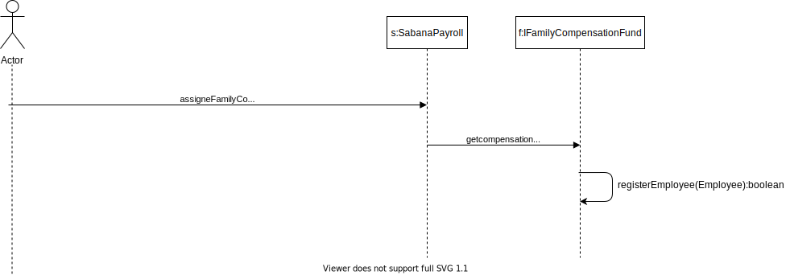

 ### Laboratorio Interfaces

 ## Parte 1

 

 - ¿Cuál es la relación entre `Circle` y `Shape`?

  Circle hereda de Shape  

 - ¿Cuál es la relación entre `Cylinder` y `Shape`?

Cylinder hereda de circle que asu vez hereda de shape

 - ¿Cuál es la relación entre `Circle` y `GeometricShape2D`?

 GeometricShape2D es una interfaz que es implementtada por circle

 - ¿Cuál es la relación entre `Cylinder` y `GeometricShape3D`?

 GeometricShape3D es una interfaz que es implementtada por cylinder

 ## Evidencia Pruebas

 

 

 ## Parte 2

 ## Evidencia Pruebas

 

 

 

 ## Parte 3

 

 ## Parte 5

 ### UML

 

 ### Secuencia

 

 ### Evidencia Pruebas

 
